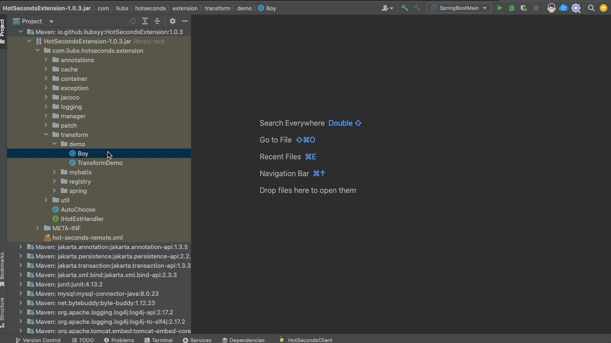

## 前言
IDEA自带的反编译插件能打开jar反编译class，遗憾的是不能编辑class，有的时候我们需要修改jar内class，需要解压->反编译class->然后新建.java->修改代码->再编译->最后打包jar。我敢说中间的过程你肯定不是一气呵成的，如果jar有依赖还要花时间去排查，打包的时候还需要注意编译jdk的版本，有的命令忘了的话还需要查手册，其实基本上全是体力活。

我翻遍了IDEA插件市场并没有找到合适的直接编辑jar的插件，于是我打算简单花点时间写一个这样的插件，可以实现无需解压直接编辑jar内的文件。

## 功能介绍
首先IDEA可以反编译jar，在jar内的class是可以直接打开看到反编译代码的，外部文件可以通过File->Project Structure->Libraries添加依赖然后反编译jar。

### 使用介绍
首先在插件市场安装插件JarEditor

然后可以在.class反编译文件中看到一个切换到Jar Editor的tab页

点击Jar Editor后可以直接对反编译的代码进行修改，修改完之后点击Save/Compile会编译当前修改的java内容并保存，然后点击Build Jar即可将编译保存的class文件写入到Jar包内。

这样编辑一个Jar包内class文件一气呵成无需解压也无需去敲命令。

下面是一个流程演示例子：

修改jar包内的资源文件也是支持的，流程和class文件是一样的，也是修改完要保存，然后再Build Jar即可。

在jar包的工程展示图，任意文件右键，可以看到JarEditor的New和Delete操作，可以新增文件和删除文件

 

### 一些机制
- 编译依赖的JDK是项目工程的JDK，可以选择编译的class目标版本，默认和jar包的class版本保持一致
- 编译java的时候依赖的classpath就是工程项目的依赖，如果依赖包找不到可以添加依赖
- Save/Compile会将修改的文件保存到jar包所在目录的jar_edit子目录下，Build Jar会把会jar_edit目录的文件增量写入jar，最后再删除这个目录
  
## 总结
此IDEA插件JarEditor可无需解压直接编辑jar包内class和资源文件，感兴趣的朋友可以去试试。

源码地址：[https://github.com/Liubsyy/JarEditor](https://github.com/Liubsyy/JarEditor)

依赖IDEA最低版本为IDEA2020.3，大于等于这个版本均可安装使用。

欢迎交流！

