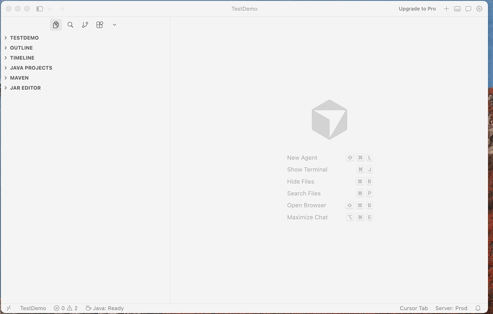
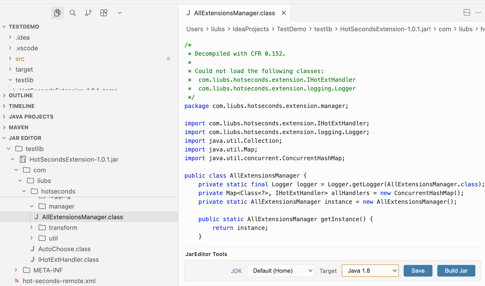
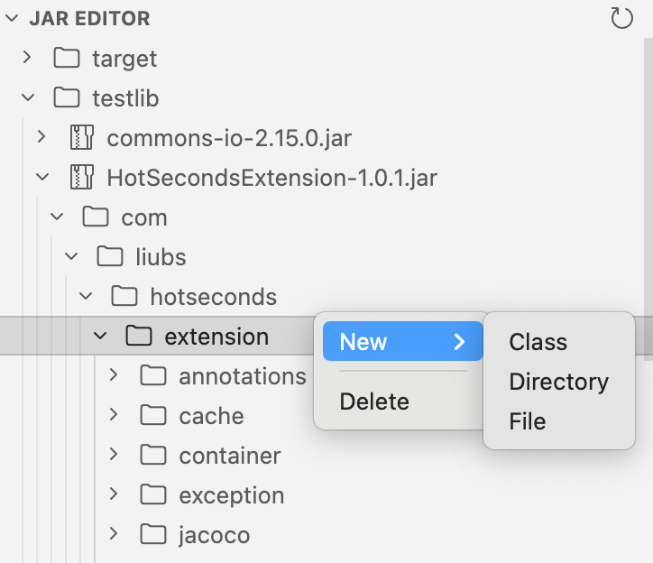

# 在 VS Code 里直接改 JAR，我复刻了JarEditor

平时做 Java 开发时，很多人应该都遇到过这种情况：

你拿到一个 JAR，只是想进去看一眼，或者改一个小地方试试，结果却要先解压、再找文件、再反编译、改完以后还得重新打包。

事情不大，但步骤很多，用起来总觉得不顺手。

所以我做了一个 VS Code 扩展，名字叫 `JarEditor`。

之前我做过一款 IDEA 插件，也叫 `JarEditor`。这次是把这套能力带到了 VS Code 里，希望让“查看、编辑、回写 JAR”这件事更简单一点。

## 它能做什么

简单来说，`JarEditor` 可以让你直接在 VS Code 里处理 JAR 文件。

现在已经支持这些功能：

- 在 Explorer 里直接浏览工作区中的 JAR
- 查看 JAR 内部的目录和文件
- 直接打开和编辑普通文本文件
- 把 `.class` 反编译成 Java 源码查看
- 修改 `.class` 后重新编译
- 在 JAR 里新增文件、目录、类
- 删除不需要的 entry
- 把修改重新构建回原始 JAR

也就是说，以前那种“解压 -> 修改 -> 再打包”的流程，现在很多时候可以直接在编辑器里做完。

## 适合什么时候用

我觉得它比较适合下面这些场景：

- 想快速看看第三方依赖包里到底有什么
- 想确认某个配置文件、资源文件是不是你预期的内容
- 想看某个 `.class` 实际反编译出来是什么样
- 想临时改一点内容做验证
- 想快速处理历史包、补丁包或者线上包

如果你平时经常和 Java 产物打交道，这种方式会省掉不少折腾。

## 怎么安装

直接在 VS Code 扩展市场搜索 `JarEditor` 安装即可。

如果你需要编辑 `.class` 并重新编译，机器上准备一个可用的 JDK 就可以了。

## 项目地址

GitHub:

https://github.com/Liubsyy/jar-editor-vscode

## 最后

从之前的 IDEA 版 `JarEditor`，到现在这个 VS Code 版，我一直想做的其实都是同一件事：让操作 JAR 这件事别那么麻烦。

如果你平时会在 VS Code 里处理 Java 项目，或者经常需要查看、修改 JAR，欢迎试试这个项目，也欢迎反馈意见。
