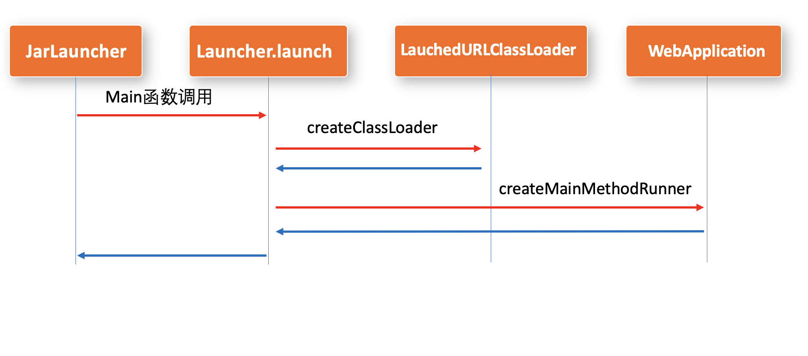

# 前言
本文将从源码角度介绍SpringBoot是如何自定义ClassLoader去加载FatJar的，以及FatJar又是如何读取jar里面嵌套jar中的类，中间会涉及到一些ClassLoader的知识。


# 类加载器基础知识


## 双亲委托机制

双亲委托指的是加载一个类的时候，先由父类加载器去加载，如果父类加载器在加载的目录加载不到，再由子加载器加载，这样做的目的是保证同一个类只加载一次。


- BootStrap Classloader : 启动类加载器，主要加载核心的类库
- Extension ClassLoader : 扩展类加载器，在java.ext.dirs或jre/lib/ext下
- Application ClassLoader : 即AppClassLoader，应用程序类加载器，普通的Java启动项目就是AppClassLoader加载


<p>一些容器都是基于AppClassLoader去扩展自定义的ClassLoader，以AppClassLoader作为父类加载器做的扩展，比如Tomcat使用的是WebAppClassLoader，SpringBoot使用的是LaunchedURLClassLoader。
</p>

另外我们自定义的ClassLoader，一般都是基于AppClassLoader去扩展的。

双亲委托指的是ClassLoader对象(ClassLoader实例)，而不是ClassLoader类的继承，它是一种对象成员来实现双亲委托的，ClassLoader加载类的源码loadClass方法如下：
```java
protected Class<?> loadClass(String name, boolean resolve)
        throws ClassNotFoundException
    {
        synchronized (getClassLoadingLock(name)) {
            // 加载过的类不再加载
            Class<?> c = findLoadedClass(name);
            if (c == null) {
                long t0 = System.nanoTime();
                //从父类加载器加载
                try {
                    if (parent != null) {
                        c = parent.loadClass(name, false);
                    } else {
                        c = findBootstrapClassOrNull(name);
                    }
                } catch (ClassNotFoundException e) {
                }

                if (c == null) {
                    //父类加载器找不到，调用findClass方法
                    long t1 = System.nanoTime();
                    c = findClass(name);

                    // this is the defining class loader; record the stats
                    sun.misc.PerfCounter.getParentDelegationTime().addTime(t1 - t0);
                    sun.misc.PerfCounter.getFindClassTime().addElapsedTimeFrom(t1);
                    sun.misc.PerfCounter.getFindClasses().increment();
                }
            }
            if (resolve) {
                resolveClass(c);
            }
            return c;
        }
    }
```
首先判断是否加载过类，如果没有加载过，由父类加载，如果父类加载不到，会调用findClass方法。

<br>

## URLClassLoader
URLClassLoader类如其名，主要是加载一些URL资源比如class和jar包等，可以复用URLClassLoader去扩展自己的ClassLoader，事实上Tomcat和SpringBoot也是这样做的。


### URL是什么？
指一种资源，包括但不限为class文件，jar包，甚至是自定义的文件。


### URL是怎么处理字节流的呢？
既然URL可以是任意文件或者资源，那读取的文件的方式也不一样
<br>
我们翻开URL.openConnection函数，可以看到是由URLStreamHandler handler处理的逻辑
```java
    public URLConnection openConnection() throws java.io.IOException {
        return handler.openConnection(this);
    }
```

这样扩展的URL就可以通过重写URLStreamHandler类实现URL的自定义加载逻辑，事实上SpringBoot的FatJAR也是这样做的。

而URLConnection中有一个getInputStream函数
>public InputStream getInputStream() throws IOException;

返回的是二进制字节流，有了InputStream就能构建资源和类了。

<br>

### URLClassLoader的来龙去脉

URLClassLoader是ClassLoader的一个派生类，通过addURL可以加载jar包

```java
    protected void addURL(URL url) {
        ucp.addURL(url);
    }
```
而ucp就是URLClassPath，管理着所有添加的URL。


URLClassLoader符合双亲委托机制，重写了findClass方法来查找Class。
```java
    protected Class<?> findClass(final String name)
        throws ClassNotFoundException
    {
        final Class<?> result;
        try {
            result = AccessController.doPrivileged(
                new PrivilegedExceptionAction<Class<?>>() {
                    public Class<?> run() throws ClassNotFoundException {
                        String path = name.replace('.', '/').concat(".class");
                        Resource res = ucp.getResource(path, false);
                        if (res != null) {
                            try {
                                return defineClass(name, res);
                            } catch (IOException e) {
                                throw new ClassNotFoundException(name, e);
                            }
                        } else {
                            return null;
                        }
                    }
                }, acc);
        } catch (java.security.PrivilegedActionException pae) {
            throw (ClassNotFoundException) pae.getException();
        }
        if (result == null) {
            throw new ClassNotFoundException(name);
        }
        return result;
    }
```

里面是从Resource res = ucp.getResource(path, false);获取到资源类的，ucp就是上文的URLClassPath。
<br>
<br>

进去 ucp.getResource 方法，可以看到getResource的实现细节，就是我上面说的URL的加载


# SpringBoot加载FatJar的原理

## FatJar结构

解压一个SpringBoot项目的的jar包，可以看到FatJar结构


**BOOT-INF** 是工程打包的文件，BOOT-INF/classes存放的是工程的代码和配置文件，BOOT-INF/lib存放的是依赖的嵌套jar包(即jar in jar)。
<br>  
**org.springframework.boot.*** 是SpringBoot启动类

打开META-INF/MANIFEST.MF，可以看到jar包的启动类
```properties
Manifest-Version: 1.0
Implementation-Title: LittleBoy
Implementation-Version: 1.0-SNAPSHOT
Archiver-Version: Plexus Archiver
Built-By: liubs
Implementation-Vendor-Id: com.thanple.little.boy
Spring-Boot-Version: 1.5.1.RELEASE
Implementation-Vendor: Pivotal Software, Inc.
Main-Class: org.springframework.boot.loader.JarLauncher
Start-Class: com.thanple.little.boy.web.WebApplication
Spring-Boot-Classes: BOOT-INF/classes/
Spring-Boot-Lib: BOOT-INF/lib/
Created-By: Apache Maven 3.6.3
Build-Jdk: 1.8.0_191
Implementation-URL: http://projects.spring.io/spring-boot/LittleBoy/
```

Main-Class是Jar包的启动类，org.springframework.boot.loader.JarLauncher，
<br>
Start-Class就是你写的项目启动的主函数

<br><br>
FatJar并不是一个标准的jar包结构，只有org.springframework.boot才是符合jar包标准的，**BOOT-INF**目录下的都是无法加载的，因此SpringBoot需要自定义加载器。

## SpringBoot启动加载类流程

刚才提到的org.springframework.boot.loader.JarLauncher，就是SpringBoot真正的启动主函数，那跟本地写的main函数类(假设为WebApplication)有什么区别呢？
普通的本地main函数，没有嵌套的Jar，是由AppClassLoader直接加载启动，而SpringBoot则是自己写了一套类加载器LaunchedURLClassLoader。

<br>

JarLauncher的main函数作为入口，创建实例调用了Launcher.launch函数

```java
public static void main(String[] args) throws Exception {
    new JarLauncher().launch(args);
}
```

Launcher.launch进入可以看到创建了一个LaunchedURLClassLoader，由LaunchedURLClassLoader去加载FatJar中的class和jar嵌套的jar(即jar in jar)。

```java
    protected void launch(String[] args) throws Exception {
        if (!this.isExploded()) {
            JarFile.registerUrlProtocolHandler();
        }
        //加载URL，由LaunchedURLClassLoader加载
        ClassLoader classLoader = this.createClassLoader(this.getClassPathArchivesIterator());
        String jarMode = System.getProperty("jarmode");
        String launchClass = jarMode != null && !jarMode.isEmpty() ? "org.springframework.boot.loader.jarmode.JarModeLauncher" : this.getMainClass();
        this.launch(args, launchClass, classLoader);
    }
    //创建LaunchedURLClassLoader
    protected ClassLoader createClassLoader(URL[] urls) throws Exception {
        return new LaunchedURLClassLoader(this.isExploded(), this.getArchive(), urls, this.getClass().getClassLoader());
    }
```

然后在this.launch(args, launchClass, classLoader)里面使用LaunchedURLClassLoader调用自己写的主函数WebApplication

```java
public class MainMethodRunner {
    //...
    public void run() throws Exception {
        Class<?> mainClass = Class.forName(this.mainClassName, false, Thread.currentThread().getContextClassLoader());
        Method mainMethod = mainClass.getDeclaredMethod("main", String[].class);
        mainMethod.setAccessible(true);
        mainMethod.invoke((Object)null, this.args);
    }
}
```

这里反射调用自己写的主函数WebApplication的main函数，这样就完成了一套加载的流程。

完整的流程链路如图所示：



## LaunchedURLClassLoader

LaunchedURLClassLoader作为SpringBoot加载FatJar的主要类加载器，继承了URLClassLoader，重写了loadClass方法，但是这个类看不到多少核心的逻辑。
```java
	@Override
	protected Class<?> loadClass(String name, boolean resolve) throws ClassNotFoundException {
		if (name.startsWith("org.springframework.boot.loader.jarmode.")) {
			try {
				Class<?> result = loadClassInLaunchedClassLoader(name);
				if (resolve) {
					resolveClass(result);
				}
				return result;
			}
			catch (ClassNotFoundException ex) {
			}
		}
		if (this.exploded) {
			return super.loadClass(name, resolve);
		}
		Handler.setUseFastConnectionExceptions(true);
		try {
			try {
				definePackageIfNecessary(name);
			}
			catch (IllegalArgumentException ex) {
				// Tolerate race condition due to being parallel capable
				if (getPackage(name) == null) {
					// This should never happen as the IllegalArgumentException indicates
					// that the package has already been defined and, therefore,
					// getPackage(name) should not return null.
					throw new AssertionError("Package " + name + " has already been defined but it could not be found");
				}
			}
			return super.loadClass(name, resolve);
		}
		finally {
			Handler.setUseFastConnectionExceptions(false);
		}
	}
```
里面区分了org.springframework.boot.loader.jarmode和其他jar区别，定义了包名，
核心的逻辑还是调用了super.loadClass，就是URLClassLoader.loadClass。

<br><br>

URLClassLoader.loadClass就是上面的加载的URL的流程，那么FatJar和普通的Jar是怎么区分逻辑的呢？
<br>
所有的不同在于Launcher.launch中的加载URL的流程中：
```
 ClassLoader classLoader = this.createClassLoader(this.getClassPathArchivesIterator());
```

ExecutableArchiveLauncher中可以看到getClassPathArchivesIterator的逻辑

```java
    protected Iterator<Archive> getClassPathArchivesIterator() throws Exception {
        Archive.EntryFilter searchFilter = this::isSearchCandidate;
        Iterator<Archive> archives = this.archive.getNestedArchives(searchFilter, (entry) -> {
            return this.isNestedArchive(entry) && !this.isEntryIndexed(entry);
        });
        if (this.isPostProcessingClassPathArchives()) {
            archives = this.applyClassPathArchivePostProcessing(archives);
        }

        return archives;
    }
```

其中getNestedArchives获取了FatJar中的jar包（jar in jar）中的归档信息，BOOT-INF/classes和BOOT-INF/lib/*.jar，每个元素都作为一个Archive，返回一个迭代器列表。

<br>


## FatJar的加载

SpringBoot在org.springframework.boot.loader.jar中重新定义了(确切的说应该是扩展)jar的实现，包括JavaFile,JavaEntry,JarURLConnection等。

<br>

this.archive.getNestedArchives一路深入进去查看源码，可以看到JarFile里面有个函数
```java
  private JarFile createJarFileFromEntry(org.springframework.boot.loader.jar.JarEntry entry) throws IOException {
        return entry.isDirectory() ? this.createJarFileFromDirectoryEntry(entry) : this.createJarFileFromFileEntry(entry);
    }
```

BOOT-INF/classes作为一个目录会构造一个JavaFile，而BOOT-INF/lib/*.jar则作为嵌套jar（jar in jar）则会构造另一个JavaFile

那么这个嵌套Jar(jar in jar)又是如何读取数据的呢？

我们在JavaFile.createJarFileFromFileEntry中可以找到逻辑
```java
    private JarFile createJarFileFromFileEntry(org.springframework.boot.loader.jar.JarEntry entry) throws IOException {
        if (entry.getMethod() != 0) {
            throw new IllegalStateException("Unable to open nested entry '" + entry.getName() + "'. It has been compressed and nested jar files must be stored without compression. Please check the mechanism used to create your executable jar file");
        } else {
            RandomAccessData entryData = this.entries.getEntryData(entry.getName());
            return new JarFile(this.rootFile, this.pathFromRoot + "!/" + entry.getName(), entryData, JarFile.JarFileType.NESTED_JAR);
        }
    }
```

其中entries就是指的外层FatJar的每一条数据，比如BOOT-INF/lib/a.jar，BOOT-INF/lib/b.jar，作为jar in jar，先获取这个jar in jar中的RandomAccessData数据流。


然后通过RandomAccessData数据流再构造一个JavaFile，这样就可以将构造的Jar in jar进行数据读取和访问了。

jar in jar 的路径大概长这样：

> LittleBoy-1.0.jar!/BOOT-INF/lib/a.jar
> 
> LittleBoy-1.0.jar!/BOOT-INF/lib/b.jar
> 
> LittleBoy-1.0.jar!/BOOT-INF/lib/c.jar

而JavaFile获取到的URL就是可以由URLClassLoader加载的URL

```java
    public URL getUrl() throws MalformedURLException {
        if (this.url == null) {
            String file = this.rootFile.getFile().toURI() + this.pathFromRoot + "!/";
            file = file.replace("file:////", "file://");
            this.url = new URL("jar", "", -1, file, new Handler(this));
        }

        return this.url;
    }
```

这里返回URL的时候 new 了一个Handler来实现URLStreamHandler处理URL的逻辑。
<br>

我们打开这个Handler的源码，org.springframework.boot.loader.jar.Handler<br>

可以看到获取URLConnection的处理逻辑
```java
    protected URLConnection openConnection(URL url) throws IOException {
        if (this.jarFile != null && this.isUrlInJarFile(url, this.jarFile)) {
            return JarURLConnection.get(url, this.jarFile);
        } else {
            try {
                return JarURLConnection.get(url, this.getRootJarFileFromUrl(url));
            } catch (Exception var3) {
                return this.openFallbackConnection(url, var3);
            }
        }
    }
```

获取到的JarURLConnection中有getInputStream方法返回查找的字节流。


返回这个字节流是如何加载到LaunchedURLClassLoader中的呢？

<br>
 
前面已经说了LaunchedURLClassLoader继承了URLClassLoader，根据URL返回的字节流，就可以根据ClassName获取到Resource，
以下是URLClassLoader.getResource方法


而这个Resource，就可以defineClass，即定义一个类
<br>
以下代码摘自URLClassLoader.findClass

```java
    protected Class<?> findClass(final String name)
        throws ClassNotFoundException
    {
        //省略部分代码
        ...
        
        String path = name.replace('.', '/').concat(".class");
        Resource res = ucp.getResource(path, false);
        if (res != null) {
            try {
                return defineClass(name, res);
            } catch (IOException e) {
                throw new ClassNotFoundException(name, e);
            }
        } else{
            return null;
        }
        
    }
```


<br>

**至此，已经把一个FatJar的加载流程全部阐述完了。**


